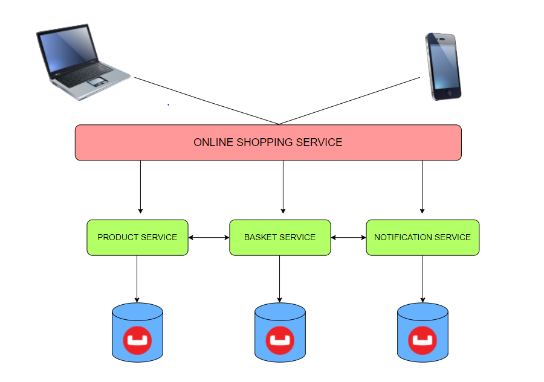

## **DESCRIPTION**

**This microservice is the first step of my individual project at the end of Trendyol Bootcamp.**

**CRUD operations of the products are made in the basket domain that I set up this service. By writing RestApi on port 9092, these operations can also be done via API.** 

**The main purpose of this service is to respond when the cart service makes an Http request for a certain product. Couchbase is used as database.**

 **The reason is to increase performance and scalability using NoSql. In the Product Service, not many transactions were made in terms of business logic.**
 
**The application is dockerized with the Dockerfile I wrote. A 3-step (build, package, test) pipeline was created during the Gitlab installation phase.**

